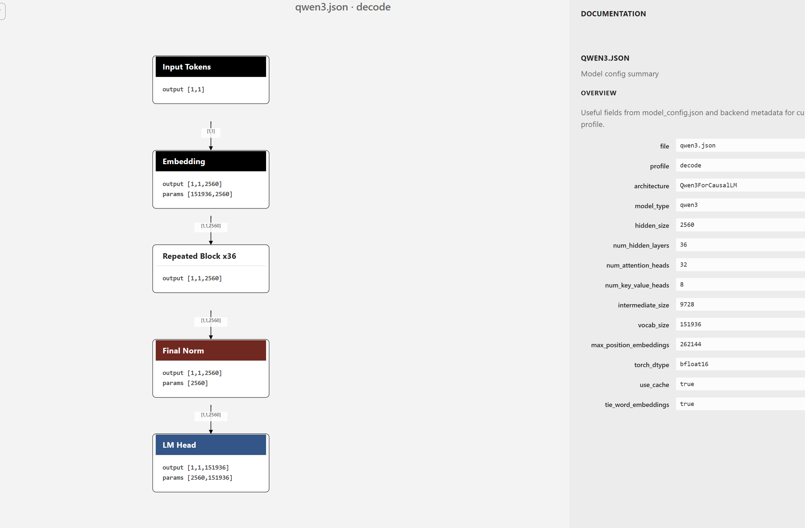

# llm-viewer

`llm-viewer` is a local visualizer for Hugging Face text generation model configs.

Drop a `config.json` into the browser. Backend computes a normalized graph bundle. Frontend renders:


- model structure
- data flow
- tensor shapes
- `prefill` / `decode` differences
- block-level detail view

Goal: make LLM architecture inspection feel closer to Netron, but for Hugging Face `model_config.json` plus runtime shape profiles instead of exported ONNX graphs.

## Features

- local browser app powered by `FastAPI`
- drag-and-drop `config.json`
- `prefill` and `decode` graph profiles
  - symbolic shape inference from `transformers` config semantics
- model graph and transformer block graph
- shape-aware edges and node summaries
- model summary sidebar from `model_config.json`
- double-click repeated block to jump into block detail
- pan, zoom, fit, reset

## Supported Models

Current decoder-family support:

- `code_llama`
- `diffllama`
- `doge`
- `granite`
- `helium`
- `llama`
- `ministral`
- `mistral`
- `olmo`
- `qwen2`
- `qwen3`
- `gemma`
- `gemma2`
- `gemma3_text`
- `gemma4_text`
- `seed_oss`
- `smollm3`
- `stablelm`

## Quick Start

Install in editable mode:

```bash
python -m pip install -e .
```

Core runtime dependencies include `fastapi`, `uvicorn`, and `transformers`.

Start the app:

```bash
llm_viewer
```

This starts a local server and opens a browser tab.

You can also run without install:

```bash
PYTHONPATH=src python -m llm_viewer
```

## CLI

Start browser app:

```bash
llm_viewer
```

Export graph JSON:

```bash
llm_viewer extract path/to/config.json --profile prefill
```

Choose profile explicitly:

```bash
llm_viewer extract path/to/config.json --profile decode --output graph.json
```

## Example Configs

Sample configs live in [`examples/`](./examples):

- [`examples/llama-config.json`](./examples/llama-config.json)
- [`examples/qwen3.json`](./examples/qwen3.json)

## How It Works

`llm-viewer` has two layers:

1. Backend:
   - parses `config.json`
   - selects an adapter by `model_type`
   - builds a normalized graph bundle for a runtime profile
2. Frontend:
   - uploads config to backend
   - renders graph, edges, labels, and side panels

Current implementation focuses on a normalized graph abstraction, not exact kernel-level execution tracing.
It does not run the model for shape inference. Backend resolves the Hugging Face config class through `transformers` and derives symbolic shapes from that config semantics.

## Project Layout

```text
src/llm_viewer/
  adapters/        model-family graph builders
  static/          browser frontend
  cli.py           CLI entrypoint
  server.py        FastAPI app
  schema.py        graph bundle schema
tests/
examples/
```

## Development

Run tests:

```bash
pytest -q
```

Run app in-place:

```bash
PYTHONPATH=src python -m llm_viewer
```

## Acknowledgements

Thanks to:

- [Netron](https://github.com/lutzroeder/netron) for excellent model visualization ideas and high-quality open source code references
- [Hugging Face Transformers](https://github.com/huggingface/transformers) for the model implementations and config ecosystem this project builds on
- the broader open source LLM tooling community for making model inspection and understanding easier

## Status

This project is still MVP-stage.

Good now:

- graph extraction for supported decoder families
- browser visualization flow
- model/block graph switching
- residual path rendering

Still rough:

- layout quality for dense graphs
- richer source/code mapping
- more model families beyond current decoder set
- better graph semantics for non-transformer architectures

## License

MIT. See [`LICENSE`](./LICENSE).
